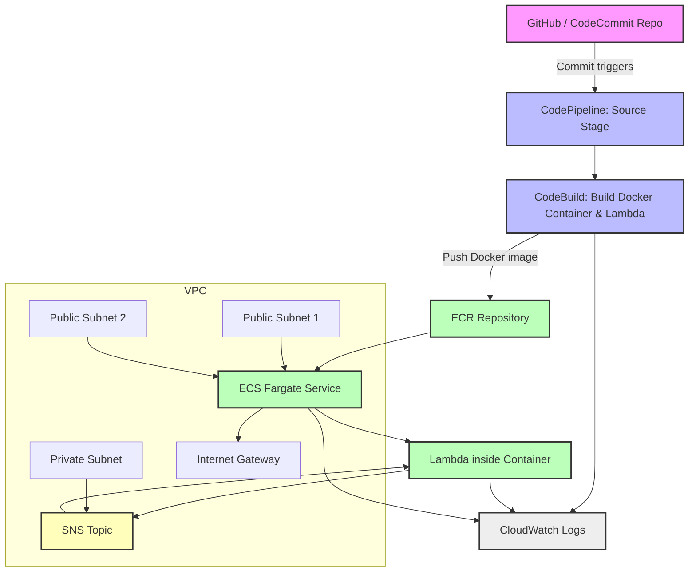

Perfect! Let’s create a **complete AWS architecture diagram** showing **networking, ECS, ECR, CodePipeline, Lambda, and SNS**. This will give you a full visual of your end-to-end system.

---

# **AWS End-to-End Architecture Diagram**

---

# **Architecture Explanation**

1. **Source Control & CI/CD**:

   * Developer pushes code → CodePipeline detects → triggers CodeBuild.

2. **CodeBuild & ECR**:

   * Builds **Go Lambda**, packages it into a **Docker container** → pushed to **ECR**.

3. **ECS Fargate Deployment**:

   * ECS pulls the latest container → runs Lambda inside the container.
   * The ECS service is deployed in **public subnets** with Internet access (if needed).

4. **Terraform-managed SNS → Lambda**:

   * Lambda is triggered by **SNS topics** deployed by Terraform.
   * SNS can reside in private subnets if needed.

5. **Networking**:

   * Public subnets for ECS service (internet access optional).
   * Private subnets for backend resources (e.g., SNS, databases).

6. **Monitoring**:

   * CloudWatch collects logs from **CodeBuild**, **ECS**, and **Lambda execution**.

---

# **Key Takeaways**

* **Fully automated CI/CD** for Go Lambda with Terraform infrastructure.
* **Containerized Lambda** ensures reproducible environments.
* **ECS + Fargate** removes the need to manage EC2 instances.
* **Terraform defines infrastructure** (SNS, Lambda, ECS, ECR, pipeline).
* **Centralized monitoring** via CloudWatch.

---

If you want, I can also make a **diagram showing multiple Lambda environments** (dev/staging/prod) with **blue-green deployments** using ECS and CodePipeline, so you can scale this architecture safely.

Do you want me to do that next?
