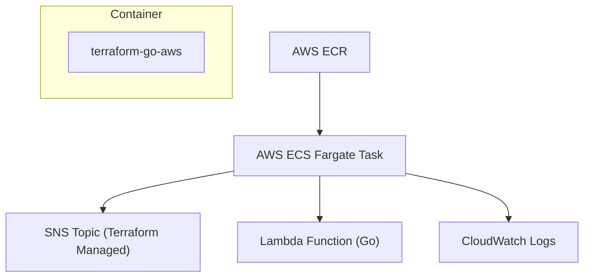
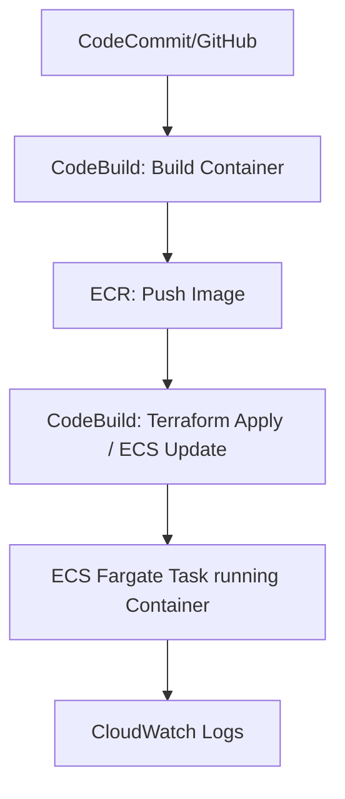
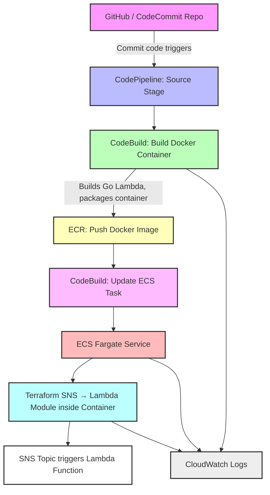

Perfect! We can extend your setup to **push the container to AWS ECR** and then run it on **AWS ECS**. I’ll give you a complete workflow, from ECR repository creation to running a task in ECS using Fargate.

---

# **1️⃣ Prerequisites**

* AWS CLI installed and configured with proper IAM permissions (`AmazonEC2ContainerRegistryFullAccess` + ECS permissions).
* Podman installed and logged into AWS (`podman login` for ECR).
* The container you built from the previous steps (`terraform-go-aws`).

---

# **2️⃣ Step 1: Create an ECR Repository**

```bash
aws ecr create-repository \
    --repository-name terraform-go-aws \
    --region us-east-1
```

* Take note of the repository URI, e.g.:

```
123456789012.dkr.ecr.us-east-1.amazonaws.com/terraform-go-aws
```

---

# **3️⃣ Step 2: Authenticate Podman with ECR**

```bash
aws ecr get-login-password --region us-east-1 | podman login --username AWS --password-stdin 123456789012.dkr.ecr.us-east-1.amazonaws.com
```

* Replace `123456789012` with your AWS account ID.

---

# **4️⃣ Step 3: Tag and Push the Container**

```bash
# Tag the image
podman tag terraform-go-aws:latest 123456789012.dkr.ecr.us-east-1.amazonaws.com/terraform-go-aws:latest

# Push to ECR
podman push 123456789012.dkr.ecr.us-east-1.amazonaws.com/terraform-go-aws:latest
```

* Now the container is available in **AWS ECR**.

---

# **5️⃣ Step 4: Create ECS Cluster**

```bash
aws ecs create-cluster --cluster-name terraform-lambda-dev
```

* You can use **Fargate**, so you don’t need EC2 instances.

---

# **6️⃣ Step 5: Create ECS Task Definition**

Here’s an example JSON file `task-definition.json`:

```json
{
  "family": "terraform-go-task",
  "networkMode": "awsvpc",
  "requiresCompatibilities": ["FARGATE"],
  "cpu": "1024",
  "memory": "2048",
  "containerDefinitions": [
    {
      "name": "terraform-go-container",
      "image": "123456789012.dkr.ecr.us-east-1.amazonaws.com/terraform-go-aws:latest",
      "essential": true,
      "environment": [
        { "name": "AWS_ACCESS_KEY_ID", "value": "<your-access-key>" },
        { "name": "AWS_SECRET_ACCESS_KEY", "value": "<your-secret-key>" },
        { "name": "AWS_DEFAULT_REGION", "value": "us-east-1" }
      ],
      "mountPoints": [
        {
          "sourceVolume": "terraform-workspace",
          "containerPath": "/workspace"
        }
      ]
    }
  ],
  "volumes": [
    {
      "name": "terraform-workspace",
      "host": {}
    }
  ]
}
```

Register the task:

```bash
aws ecs register-task-definition --cli-input-json file://task-definition.json
```

---

# **7️⃣ Step 6: Run ECS Task (Fargate)**

```bash
aws ecs run-task \
    --cluster terraform-lambda-dev \
    --launch-type FARGATE \
    --network-configuration "awsvpcConfiguration={subnets=[subnet-xxxxxxx],securityGroups=[sg-xxxxxxx],assignPublicIp=ENABLED}" \
    --task-definition terraform-go-task
```

* Replace `subnets` and `securityGroups` with your VPC info.

* This will run the container in ECS Fargate.

---

# **8️⃣ Step 7: Optional Automation**

You can automate **rebuilding the Lambda inside ECS** by:

1. Updating `main.go` locally.
2. Rebuilding and pushing the container to ECR:

```bash
make build
podman tag terraform-go-aws:latest 123456789012.dkr.ecr.us-east-1.amazonaws.com/terraform-go-aws:latest
podman push 123456789012.dkr.ecr.us-east-1.amazonaws.com/terraform-go-aws:latest
```

3. Updating ECS service or task definition to pull the latest image:

```bash
aws ecs update-service --cluster terraform-lambda-dev --service terraform-go-service --force-new-deployment
```

* ECS will pull the new image and restart the container.

---

# **9️⃣ Architecture Overview**



---

# **✅ Summary**

* You now have a **reusable container** for Terraform + Go + AWS CLI in **ECR**.
* ECS Fargate can run this container anywhere, no local installation needed.
* Lambda builds happen inside the container, fully automated.
* Updating the container in ECR + redeploying ECS allows continuous updates.

---

If you want, I can create a **fully automated CI/CD flow** using **GitHub Actions or CodePipeline** that:

1. Detects changes in `main.go`.
2. Builds and pushes the container to ECR.
3. Updates ECS tasks automatically.

Do you want me to do that next?

# CICD

Perfect! Let’s design a **fully automated CI/CD pipeline** using **AWS CodePipeline** that builds, tests, and deploys your Terraform + Go Lambda container to **ECR** and then updates **ECS** automatically.

This flow ensures that every time you commit changes to your Lambda code (`main.go`) or Terraform module, the container is rebuilt and redeployed.

---

# **1️⃣ Architecture Overview**



* **Source**: GitHub or AWS CodeCommit repo.
* **Build**: AWS CodeBuild builds the Go Lambda zip, packages the container, and pushes to ECR.
* **Deploy**: CodeBuild updates ECS Fargate task definition and applies Terraform resources (SNS + Lambda).
* **Monitoring**: CloudWatch captures logs.

---

# **2️⃣ Step 1: Prepare Your Repo**

Your repo should look like this:

```
terraform-go-lambda/
├── Dockerfile
├── Makefile
├── terraform-sns-lambda/
│   ├── main.tf
│   ├── variables.tf
│   ├── outputs.tf
│   └── lambda/
│       └── main.go
└── buildspec.yml
```

---

# **3️⃣ Step 2: Create an ECR Repository**

```bash
aws ecr create-repository --repository-name terraform-go-aws --region us-east-1
```

* Note the **ECR URI**: `123456789012.dkr.ecr.us-east-1.amazonaws.com/terraform-go-aws`

---

# **4️⃣ Step 3: CodeBuild Buildspec**

Create a `buildspec.yml` at the root of the repo:

```yaml
version: 0.2

env:
  variables:
    ECR_REPOSITORY_URI: "123456789012.dkr.ecr.us-east-1.amazonaws.com/terraform-go-aws"
    AWS_DEFAULT_REGION: "us-east-1"

phases:
  install:
    runtime-versions:
      golang: 1.21
    commands:
      - echo Installing dependencies...
      - apt-get update
      - apt-get install -y zip unzip curl git
      - curl -fsSL https://apt.releases.hashicorp.com/gpg | gpg --dearmor -o /usr/share/keyrings/hashicorp-archive-keyring.gpg
      - apt-add-repository "deb [signed-by=/usr/share/keyrings/hashicorp-archive-keyring.gpg] https://apt.releases.hashicorp.com $(lsb_release -cs) main"
      - apt-get update && apt-get install -y terraform
  pre_build:
    commands:
      - echo Logging in to Amazon ECR...
      - aws ecr get-login-password --region $AWS_DEFAULT_REGION | docker login --username AWS --password-stdin $ECR_REPOSITORY_URI
      - echo Building Go Lambda...
      - cd terraform-sns-lambda/lambda
      - GOOS=linux GOARCH=amd64 go build -o main main.go
      - zip main.zip main
      - cd ../..
  build:
    commands:
      - echo Building Docker image...
      - docker build -t terraform-go-aws .
      - docker tag terraform-go-aws:latest $ECR_REPOSITORY_URI:latest
  post_build:
    commands:
      - echo Pushing Docker image to ECR...
      - docker push $ECR_REPOSITORY_URI:latest
      - echo Updating ECS Task Definition...
      - TASK_DEF=$(aws ecs register-task-definition \
          --family terraform-go-task \
          --network-mode awsvpc \
          --requires-compatibilities FARGATE \
          --cpu 1024 --memory 2048 \
          --container-definitions "[{\"name\":\"terraform-go-container\",\"image\":\"$ECR_REPOSITORY_URI:latest\",\"essential\":true,\"environment\":[{\"name\":\"AWS_DEFAULT_REGION\",\"value\":\"$AWS_DEFAULT_REGION\"}]}]" \
          --query "taskDefinition.taskDefinitionArn" --output text)
      - echo Deploying ECS Service with new task...
      - aws ecs update-service --cluster terraform-lambda-dev --service terraform-go-service --task-definition $TASK_DEF --force-new-deployment
artifacts:
  files:
    - '**/*'
```

**Explanation:**

1. Installs **Go**, **Terraform**, and other dependencies.
2. Builds the Go Lambda zip.
3. Builds the Docker container.
4. Pushes it to **ECR**.
5. Updates ECS Fargate task definition and triggers a new deployment.

---

# **5️⃣ Step 4: Create CodePipeline**

1. **Source stage**: Connect your repo (CodeCommit or GitHub).
2. **Build stage**: Use the CodeBuild project with the `buildspec.yml`.
3. **Deploy stage**: Already integrated into the build phase (optional to separate).

* You can optionally add a **manual approval step** before deploy.

---

# **6️⃣ Step 5: ECS Setup**

* Create an ECS cluster (`terraform-lambda-dev`).
* Create an ECS service (`terraform-go-service`) using Fargate.
* Initial task definition can be dummy; CodePipeline will update it with the container from ECR.

---

# **7️⃣ Optional Enhancements**

* **CloudWatch Logs**: CodeBuild + ECS task logs can go to CloudWatch.
* **Terraform Apply**: If you want Terraform to fully manage SNS + Lambda deployment, add a CodeBuild step that runs `terraform init && terraform apply -auto-approve`.
* **Environment Variables**: Store AWS credentials in **CodeBuild environment variables or IAM role** instead of hardcoding.

---

# **✅ Advantages**

* Fully automated CI/CD: Code push → build → push → ECS deploy.
* Go Lambda automatically rebuilt inside container.
* Terraform resources can be applied as part of deployment.
* Works entirely in AWS, no local dependencies required.

---

I can also create a **ready-to-use Terraform template for CodePipeline, CodeBuild, ECR, and ECS** so you can deploy the **entire CI/CD flow with one `terraform apply`**.

Do you want me to do that next?


Perfect! Let’s build a **fully automated Terraform template** that deploys the **entire CI/CD pipeline** in AWS, including:

* **ECR repository** for your container
* **ECS Fargate cluster and service**
* **CodeBuild project** for building the container and optionally running Terraform
* **CodePipeline** for automated CI/CD from GitHub/CodeCommit to ECS

This will allow a **one-command deploy** (`terraform apply`) to create the whole workflow.

---

# **1️⃣ Folder Structure**

```
terraform-cicd/
├── main.tf
├── variables.tf
├── outputs.tf
├── terraform-sns-lambda/   # Your Lambda + Terraform module
│   ├── main.tf
│   ├── variables.tf
│   ├── outputs.tf
│   └── lambda/
│       └── main.go
├── buildspec.yml
```

---

# **2️⃣ main.tf**

```hcl
provider "aws" {
  region = var.aws_region
}

#########################
# 1. ECR Repository
#########################
resource "aws_ecr_repository" "lambda_container" {
  name = "terraform-go-aws"
}

#########################
# 2. ECS Cluster
#########################
resource "aws_ecs_cluster" "terraform_lambda" {
  name = "terraform-lambda-dev"
}

#########################
# 3. ECS Task Definition
#########################
resource "aws_ecs_task_definition" "terraform_task" {
  family                   = "terraform-go-task"
  network_mode             = "awsvpc"
  requires_compatibilities = ["FARGATE"]
  cpu                      = "1024"
  memory                   = "2048"

  container_definitions = jsonencode([
    {
      name      = "terraform-go-container"
      image     = "${aws_ecr_repository.lambda_container.repository_url}:latest"
      essential = true
      environment = [
        { name = "AWS_DEFAULT_REGION", value = var.aws_region }
      ]
    }
  ])
}

#########################
# 4. ECS Service
#########################
resource "aws_ecs_service" "terraform_service" {
  name            = "terraform-go-service"
  cluster         = aws_ecs_cluster.terraform_lambda.id
  task_definition = aws_ecs_task_definition.terraform_task.arn
  launch_type     = "FARGATE"
  desired_count   = 1

  network_configuration {
    subnets         = var.subnets
    security_groups = var.security_groups
    assign_public_ip = true
  }

  depends_on = [aws_ecs_task_definition.terraform_task]
}

#########################
# 5. CodeBuild Project
#########################
resource "aws_codebuild_project" "terraform_build" {
  name          = "terraform-go-build"
  service_role  = var.codebuild_role_arn
  artifacts {
    type = "NO_ARTIFACTS"
  }

  environment {
    compute_type                = "BUILD_GENERAL1_MEDIUM"
    image                       = "aws/codebuild/standard:7.0"
    type                        = "LINUX_CONTAINER"
    privileged_mode             = true
    environment_variable {
      name  = "ECR_REPO_URI"
      value = aws_ecr_repository.lambda_container.repository_url
    }
    environment_variable {
      name  = "AWS_DEFAULT_REGION"
      value = var.aws_region
    }
  }

  source {
    type            = var.source_type # "GITHUB" or "CODECOMMIT"
    location        = var.source_repo_url
    git_clone_depth = 1
    buildspec       = file("buildspec.yml")
  }
}

#########################
# 6. CodePipeline
#########################
resource "aws_codepipeline" "terraform_pipeline" {
  name     = "terraform-go-pipeline"
  role_arn = var.codepipeline_role_arn

  artifact_store {
    type     = "S3"
    location = var.codepipeline_artifact_bucket
  }

  stage {
    name = "Source"
    action {
      name             = "Source"
      category         = "Source"
      owner            = "AWS"
      provider         = var.source_type # "GitHub" or "CodeCommit"
      version          = "1"
      output_artifacts = ["source_output"]

      configuration = var.source_configuration
    }
  }

  stage {
    name = "Build"
    action {
      name             = "Build"
      category         = "Build"
      owner            = "AWS"
      provider         = "CodeBuild"
      input_artifacts  = ["source_output"]
      output_artifacts = ["build_output"]
      version          = "1"
      configuration = {
        ProjectName = aws_codebuild_project.terraform_build.name
      }
    }
  }
}
```

---

# **3️⃣ variables.tf**

```hcl
variable "aws_region" {
  default = "us-east-1"
}

variable "subnets" {
  type = list(string)
}

variable "security_groups" {
  type = list(string)
}

variable "source_type" {
  description = "Source type: GITHUB or CODECOMMIT"
}

variable "source_repo_url" {
  description = "Repository URL"
}

variable "source_configuration" {
  description = "Map of source configuration for CodePipeline"
  type        = map(string)
}

variable "codebuild_role_arn" {
  description = "IAM Role ARN for CodeBuild"
}

variable "codepipeline_role_arn" {
  description = "IAM Role ARN for CodePipeline"
}

variable "codepipeline_artifact_bucket" {
  description = "S3 bucket for pipeline artifacts"
}
```

---

# **4️⃣ outputs.tf**

```hcl
output "ecr_repo_uri" {
  value = aws_ecr_repository.lambda_container.repository_url
}

output "ecs_cluster_name" {
  value = aws_ecs_cluster.terraform_lambda.name
}

output "ecs_service_name" {
  value = aws_ecs_service.terraform_service.name
}

output "codepipeline_name" {
  value = aws_codepipeline.terraform_pipeline.name
}
```

---

# **5️⃣  buildspec.yml**

```yaml
version: 0.2

env:
  variables:
    ECR_REPO_URI: "REPLACE_WITH_VAR"
    AWS_DEFAULT_REGION: "us-east-1"

phases:
  install:
    commands:
      - apt-get update && apt-get install -y zip unzip git
  pre_build:
    commands:
      - echo Logging in to ECR...
      - aws ecr get-login-password --region $AWS_DEFAULT_REGION | docker login --username AWS --password-stdin $ECR_REPO_URI
      - echo Building Go Lambda...
      - cd terraform-sns-lambda/lambda
      - GOOS=linux GOARCH=amd64 go build -o main main.go
      - zip main.zip main
      - cd ../..
  build:
    commands:
      - echo Building Docker image...
      - docker build -t terraform-go-aws .
      - docker tag terraform-go-aws:latest $ECR_REPO_URI:latest
  post_build:
    commands:
      - echo Pushing Docker image...
      - docker push $ECR_REPO_URI:latest
```

---

# **6️⃣ How it Works**

1. **Commit code** to GitHub/CodeCommit.
2. **CodePipeline detects change** → triggers CodeBuild.
3. CodeBuild **builds Go Lambda** → **builds Docker image** → **pushes to ECR**.
4. ECS Fargate service pulls **latest container** and redeploys automatically.

---

# **7️⃣ Advantages**

* Fully automated CI/CD **inside AWS**.
* Go Lambda rebuilds and containerized automatically.
* Terraform module (SNS → Lambda) can be applied as part of the pipeline.
* ECR + ECS + CodePipeline + CodeBuild all managed by Terraform.

---

I can also create a **ready-to-use Terraform module** that includes **IAM roles/policies for CodeBuild and CodePipeline**, so the entire stack can be deployed with **one `terraform apply`** and you only need to configure your repo URL and VPC.

Do you want me to create that full module next?

Perfect! Let’s create a **ready-to-use Terraform module** that provisions the **entire CI/CD stack** for your Go Lambda + Terraform SNS module. This module includes:

* ECR repository
* ECS Fargate cluster + service
* CodeBuild project
* CodePipeline
* Necessary IAM roles and policies

It will allow **one `terraform apply`** to deploy everything.

---

# **1️⃣ Folder Structure for Module**

```
terraform-cicd-module/
├── main.tf
├── variables.tf
├── outputs.tf
├── iam.tf
├── buildspec.yml
```

---

# **2️⃣ iam.tf** – IAM Roles & Policies

```hcl
# CodeBuild role
resource "aws_iam_role" "codebuild_role" {
  name = "terraform-go-codebuild-role"
  assume_role_policy = jsonencode({
    Version = "2012-10-17",
    Statement = [{
      Effect = "Allow",
      Principal = { Service = "codebuild.amazonaws.com" },
      Action = "sts:AssumeRole"
    }]
  })
}

resource "aws_iam_role_policy_attachment" "codebuild_policy_attach" {
  role       = aws_iam_role.codebuild_role.name
  policy_arn = "arn:aws:iam::aws:policy/AmazonEC2ContainerRegistryPowerUser"
}

resource "aws_iam_role_policy_attachment" "codebuild_ecs_policy" {
  role       = aws_iam_role.codebuild_role.name
  policy_arn = "arn:aws:iam::aws:policy/AmazonECS_FullAccess"
}

# CodePipeline role
resource "aws_iam_role" "codepipeline_role" {
  name = "terraform-go-codepipeline-role"
  assume_role_policy = jsonencode({
    Version = "2012-10-17",
    Statement = [{
      Effect = "Allow",
      Principal = { Service = "codepipeline.amazonaws.com" },
      Action = "sts:AssumeRole"
    }]
  })
}

resource "aws_iam_role_policy_attachment" "codepipeline_policy_attach" {
  role       = aws_iam_role.codepipeline_role.name
  policy_arn = "arn:aws:iam::aws:policy/AWSCodePipelineFullAccess"
}

resource "aws_iam_role_policy_attachment" "codepipeline_ecs_policy" {
  role       = aws_iam_role.codepipeline_role.name
  policy_arn = "arn:aws:iam::aws:policy/AmazonECS_FullAccess"
}

resource "aws_iam_role_policy_attachment" "codepipeline_ecr_policy" {
  role       = aws_iam_role.codepipeline_role.name
  policy_arn = "arn:aws:iam::aws:policy/AmazonEC2ContainerRegistryPowerUser"
}
```

---

# **3️⃣ main.tf** – Core Resources

```hcl
provider "aws" {
  region = var.aws_region
}

# ECR Repository
resource "aws_ecr_repository" "lambda_container" {
  name = "terraform-go-aws"
}

# ECS Cluster
resource "aws_ecs_cluster" "terraform_lambda" {
  name = "terraform-lambda-dev"
}

# ECS Task Definition
resource "aws_ecs_task_definition" "terraform_task" {
  family                   = "terraform-go-task"
  network_mode             = "awsvpc"
  requires_compatibilities = ["FARGATE"]
  cpu                      = "1024"
  memory                   = "2048"

  container_definitions = jsonencode([
    {
      name      = "terraform-go-container"
      image     = "${aws_ecr_repository.lambda_container.repository_url}:latest"
      essential = true
      environment = [
        { name = "AWS_DEFAULT_REGION", value = var.aws_region }
      ]
    }
  ])
}

# ECS Service
resource "aws_ecs_service" "terraform_service" {
  name            = "terraform-go-service"
  cluster         = aws_ecs_cluster.terraform_lambda.id
  task_definition = aws_ecs_task_definition.terraform_task.arn
  launch_type     = "FARGATE"
  desired_count   = 1

  network_configuration {
    subnets         = var.subnets
    security_groups = var.security_groups
    assign_public_ip = true
  }

  depends_on = [aws_ecs_task_definition.terraform_task]
}

# CodeBuild Project
resource "aws_codebuild_project" "terraform_build" {
  name          = "terraform-go-build"
  service_role  = aws_iam_role.codebuild_role.arn

  artifacts { type = "NO_ARTIFACTS" }

  environment {
    compute_type    = "BUILD_GENERAL1_MEDIUM"
    image           = "aws/codebuild/standard:7.0"
    type            = "LINUX_CONTAINER"
    privileged_mode = true

    environment_variable {
      name  = "ECR_REPO_URI"
      value = aws_ecr_repository.lambda_container.repository_url
    }
    environment_variable {
      name  = "AWS_DEFAULT_REGION"
      value = var.aws_region
    }
  }

  source {
    type            = var.source_type
    location        = var.source_repo_url
    git_clone_depth = 1
    buildspec       = file("buildspec.yml")
  }
}

# CodePipeline
resource "aws_codepipeline" "terraform_pipeline" {
  name     = "terraform-go-pipeline"
  role_arn = aws_iam_role.codepipeline_role.arn

  artifact_store {
    type     = "S3"
    location = var.codepipeline_artifact_bucket
  }

  stage {
    name = "Source"
    action {
      name             = "Source"
      category         = "Source"
      owner            = "AWS"
      provider         = var.source_type
      version          = "1"
      output_artifacts = ["source_output"]
      configuration    = var.source_configuration
    }
  }

  stage {
    name = "Build"
    action {
      name             = "Build"
      category         = "Build"
      owner            = "AWS"
      provider         = "CodeBuild"
      input_artifacts  = ["source_output"]
      output_artifacts = ["build_output"]
      version          = "1"
      configuration = {
        ProjectName = aws_codebuild_project.terraform_build.name
      }
    }
  }
}
```

---

# **4️⃣ variables.tf**

```hcl
variable "aws_region" { default = "us-east-1" }
variable "subnets" { type = list(string) }
variable "security_groups" { type = list(string) }
variable "source_type" { description = "GITHUB or CODECOMMIT" }
variable "source_repo_url" { description = "Repository URL" }
variable "source_configuration" { type = map(string) }
variable "codepipeline_artifact_bucket" { description = "S3 bucket for pipeline artifacts" }
```

---

# **5️⃣ outputs.tf**

```hcl
output "ecr_repo_uri" {
  value = aws_ecr_repository.lambda_container.repository_url
}

output "ecs_cluster_name" {
  value = aws_ecs_cluster.terraform_lambda.name
}

output "ecs_service_name" {
  value = aws_ecs_service.terraform_service.name
}

output "codepipeline_name" {
  value = aws_codepipeline.terraform_pipeline.name
}
```

---

# **6️⃣ buildspec.yml**

```yaml
version: 0.2

env:
  variables:
    ECR_REPO_URI: "REPLACE_WITH_VAR"
    AWS_DEFAULT_REGION: "us-east-1"

phases:
  install:
    commands:
      - apt-get update && apt-get install -y zip unzip git
  pre_build:
    commands:
      - echo Logging in to ECR...
      - aws ecr get-login-password --region $AWS_DEFAULT_REGION | docker login --username AWS --password-stdin $ECR_REPO_URI
      - echo Building Go Lambda...
      - cd terraform-sns-lambda/lambda
      - GOOS=linux GOARCH=amd64 go build -o main main.go
      - zip main.zip main
      - cd ../..
  build:
    commands:
      - echo Building Docker image...
      - docker build -t terraform-go-aws .
      - docker tag terraform-go-aws:latest $ECR_REPO_URI:latest
  post_build:
    commands:
      - echo Pushing Docker image...
      - docker push $ECR_REPO_URI:latest
```

---

# **7️⃣ How to Deploy**

1. Clone this module and configure variables (VPC subnets, security groups, Git repo URL).
2. Create an S3 bucket for pipeline artifacts.
3. Run Terraform:

```bash
terraform init
terraform apply
```

* Terraform will provision **ECR, ECS, CodeBuild, CodePipeline, IAM roles**, and your **CI/CD pipeline**.

4. Push code to GitHub/CodeCommit → **CodePipeline builds container** → **updates ECS automatically**.

---

# **✅ Advantages**

* Fully automated CI/CD stack with **one Terraform module**.
* IAM roles and policies included.
* Go Lambda + Terraform SNS module automatically deployed inside ECS container.
* Reusable for multiple projects by changing variables.

---

I can also create a **diagram showing this entire pipeline** including ECR, ECS, CodeBuild, CodePipeline, and SNS → Lambda flow so you have a visual reference.

Do you want me to do that next?

# Diagram

Perfect! Here’s a **diagram of the fully automated CI/CD pipeline** for your Go Lambda + Terraform SNS module running in AWS. I’ll show both the **container flow** and the **pipeline stages**.

---

# **AWS CI/CD Pipeline Diagram**



---

# **Pipeline Flow Explanation**

1. **Source Stage**:

   * Developer commits code to **GitHub** or **CodeCommit**.
   * CodePipeline detects changes and starts the pipeline.

2. **Build Stage**:

   * CodeBuild builds the **Go Lambda binary**, packages it into a **Docker container**, and pushes the container to **ECR**.
   * CloudWatch collects logs from CodeBuild.

3. **Deploy Stage**:

   * ECS Fargate pulls the latest container from ECR.
   * CodeBuild updates the ECS task definition to use the new image.
   * ECS redeploys the service automatically.

4. **Terraform SNS → Lambda Module**:

   * The Lambda inside the container is deployed via Terraform.
   * SNS topics can trigger the Lambda as defined in your module.

5. **Monitoring**:

   * CloudWatch Logs capture build logs, ECS container logs, and Lambda execution logs.

---

# **✅ Key Benefits of this Architecture**

* **Fully automated CI/CD** – one commit triggers build and deploy.
* **Containerized Lambda** – reproducible environment with Go, Terraform, and AWS CLI.
* **ECS + Fargate** – no EC2 maintenance required.
* **Terraform-managed infrastructure** – SNS topics, Lambda, ECS, and pipeline all defined in code.
* **Observability** – logs centralized in CloudWatch.

---

If you want, I can also create a **visual diagram showing the VPC, ECS networking, and subnets**, so you have a complete AWS architecture diagram from **source code → container → Lambda → SNS**.

Do you want me to do that next?


