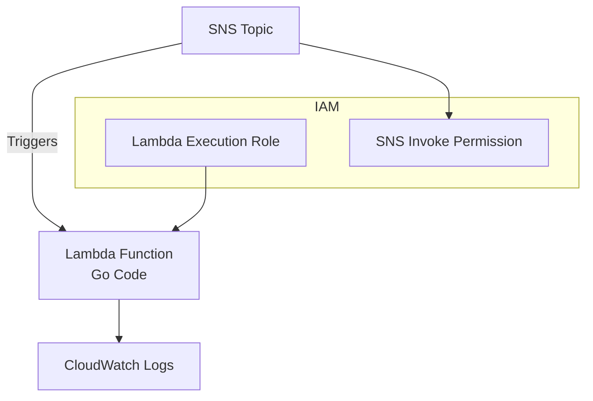

Got it! You want a **modular Terraform setup** (a “module”) that provisions:

* SNS topic
* Lambda function
* SNS → Lambda subscription

…with the **Lambda code in Go** as an input to the module. I’ll create a clean **Terraform module structure**, inputs, outputs, and sample Go Lambda.

---

# **1️⃣ Module Structure**

```
terraform-sns-lambda/
├── main.tf
├── variables.tf
├── outputs.tf
└── lambda/
    └── main.go
```

---

# **2️⃣ `variables.tf`**

```hcl
variable "lambda_name" {
  description = "Name of the Lambda function"
  type        = string
}

variable "sns_topic_name" {
  description = "Name of the SNS topic"
  type        = string
}

variable "lambda_handler_zip" {
  description = "Path to the zipped Go Lambda code"
  type        = string
}

variable "lambda_runtime" {
  description = "Lambda runtime"
  type        = string
  default     = "go1.x"
}
```

---

# **3️⃣ `main.tf`**

```hcl
########################################
# SNS Topic
########################################
resource "aws_sns_topic" "sns_topic" {
  name = var.sns_topic_name
}

########################################
# IAM Role for Lambda
########################################
resource "aws_iam_role" "lambda_role" {
  name = "${var.lambda_name}-role"

  assume_role_policy = jsonencode({
    Version = "2012-10-17"
    Statement = [{
      Effect    = "Allow"
      Principal = { Service = "lambda.amazonaws.com" }
      Action    = "sts:AssumeRole"
    }]
  })
}

resource "aws_iam_role_policy_attachment" "lambda_basic" {
  role       = aws_iam_role.lambda_role.name
  policy_arn = "arn:aws:iam::aws:policy/service-role/AWSLambdaBasicExecutionRole"
}

########################################
# Lambda Function
########################################
resource "aws_lambda_function" "lambda" {
  function_name = var.lambda_name
  handler       = "main"
  runtime       = var.lambda_runtime
  filename      = var.lambda_handler_zip
  role          = aws_iam_role.lambda_role.arn
}

########################################
# SNS → Lambda Subscription
########################################
resource "aws_sns_topic_subscription" "lambda_subscription" {
  topic_arn = aws_sns_topic.sns_topic.arn
  protocol  = "lambda"
  endpoint  = aws_lambda_function.lambda.arn
}

########################################
# Permission: Allow SNS to invoke Lambda
########################################
resource "aws_lambda_permission" "allow_sns" {
  statement_id  = "AllowExecutionFromSNS"
  action        = "lambda:InvokeFunction"
  function_name = aws_lambda_function.lambda.function_name
  principal     = "sns.amazonaws.com"
  source_arn    = aws_sns_topic.sns_topic.arn
}
```

---

# **4️⃣ `outputs.tf`**

```hcl
output "sns_topic_arn" {
  description = "ARN of the SNS topic"
  value       = aws_sns_topic.sns_topic.arn
}

output "lambda_function_arn" {
  description = "ARN of the Lambda function"
  value       = aws_lambda_function.lambda.arn
}
```

---

# **5️⃣ Sample Go Lambda (`lambda/main.go`)**

```go
package main

import (
    "context"
    "fmt"

    "github.com/aws/aws-lambda-go/lambda"
    "github.com/aws/aws-lambda-go/events"
)

func handler(ctx context.Context, snsEvent events.SNSEvent) error {
    for _, record := range snsEvent.Records {
        snsRecord := record.SNS
        fmt.Printf("Message received: %s\n", snsRecord.Message)
    }
    return nil
}

func main() {
    lambda.Start(handler)
}
```

### ✅ **Notes:**

* Go Lambda must be built and zipped for Terraform deployment:

```bash
cd lambda
GOOS=linux GOARCH=amd64 go build -o main main.go
zip main.zip main
```

* Then pass the path to the zip file as `lambda_handler_zip` in the module.

---

# **6️⃣ Sample Module Usage**

```hcl
module "sns_lambda" {
  source            = "./terraform-sns-lambda"
  lambda_name       = "my-go-lambda"
  sns_topic_name    = "my-sns-topic"
  lambda_handler_zip = "./lambda/main.zip"
}
```

---

# **7️⃣ Architecture Diagram (Mermaid)**



---

This module is **fully reusable**:

* You can deploy multiple SNS → Lambda pipelines by just calling the module with different inputs.
* The Lambda runtime is **Go (`go1.x`)**, but you can also parameterize it for Node, Python, etc.

---

I can also make a **version that builds the Go Lambda automatically with Terraform**, so you don’t have to zip manually. That way it’s fully **IaC + CI/CD ready**.

Do you want me to do that next?
